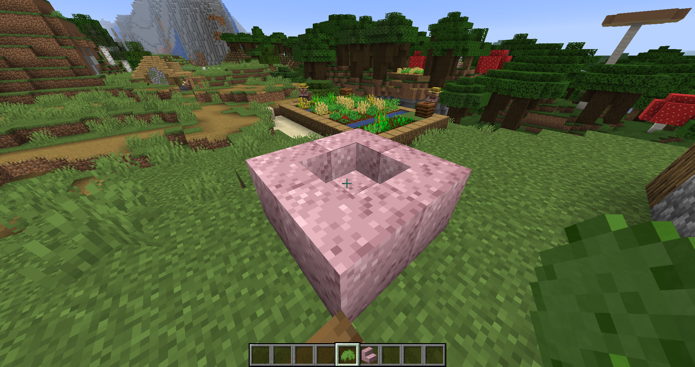
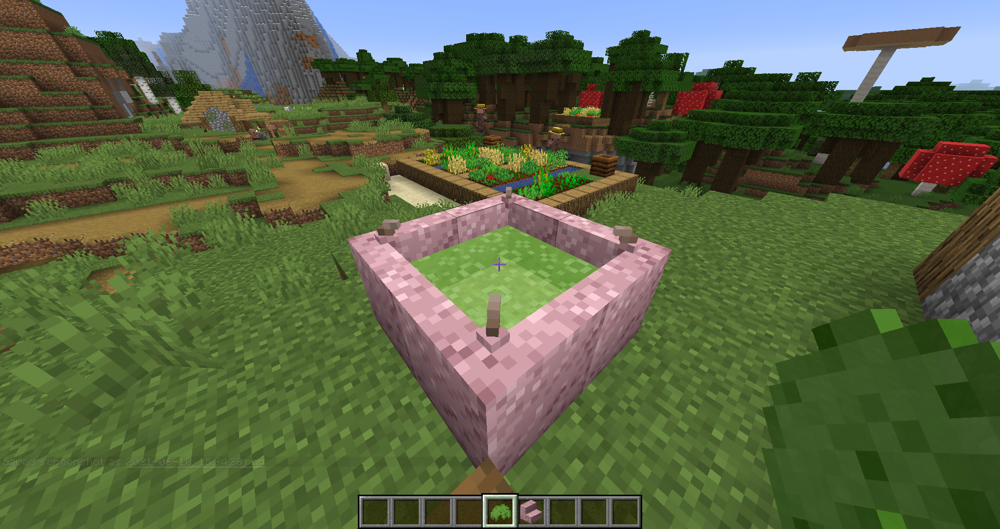

Biomancy is a Biopunk inspired Mod and themed around flesh magic and bio-manipulation.

**Mod Integrations**

- [x] JEI
- [ ] Patchouli WIP

## Features

### Items

- Claws
    - Leech Claw: reduced attack distance but leaches enemy health
    - Long Range Claw: features greater attack distance on critical hit, aoe harvest for blocks
- Blighbringer Axe: reduces max health of enemies if your health is below 75% of the max health of the enemy
- Fleshborn Tools: feature 3x3 aoe harvest (sneak to disable) and adapts to the block they are harvesting
- Enchantable Guns (accept some Bow/Crossbow enchantments)
    - Tooth Gun: eats nutrient paste to reload ammo
    - Withershot: eats wither skulls to reload ammo
- Item Storage Bag (4k of a single item):
    - on sneak click takes/put items from/in offhand
    - Devour Mode: take items from player inventory and store them; on right click of a block with an inventory extract items from it
    - Replenish Mode: refill items in player main/off-hand; on right click of a block with an inventory fill it with items
- Entity Storage Bag
- Injection Device:
    - force inject Mobs or Blocks with reagents (**some reagents can't be injected into everything**)
    - loaded/unloaded via glass-vials/reagents in offhand and sneak clicking
    - when empty it can extract blood from entities
- Boomling-nade (heat seeking potion)
    - combine with splash potion in crafting table
    - sneak click to pick back up once thrown

#### Reagents

- Insomnia Cure (resets the last slept time, no need for sleep)
- Breeding Stimulant (reset in love timer)
- Blood Sample (contains genetic material, inject a flesh blob with it and inject ample mutagen)
- Mutagen Serum (induces mutations in flesh blobs and some other mobs (Villagers, Animals, Guardians))
- Rejuvenation Serum (reverse growth)
- Growth Serum (induce growth, even for reeds, cactus & nether wart)
- Cleansing Serum (removes all potion effects, removes genetic material from flesh blobs)
- Decay Serum (strongly affects zombies)

#### Enchantments

- Millipedes (for boots; spider climbing)
- Copepod's Leap (for pants; sneak+jump to riptide jump without water; free elytra launch boost)
- Attuning Bane (attunes to the killed entity type and becomes Bane of x)
- Quick Shot (for gun; decreases shoot delay)
- Max Ammo (for gun; increases max ammo)

### Blocks

- Flesh (Blocks, Slabs, Stairs)
- Ownable
    - Fleshborn Door
    - Trapdoor, Pressure Plate (sneak click to change mode)

#### Machines

- Chewer (uses Nutrient Paste/Bar as Fuel)
- Digester (uses Water as fuel)
- Decomposer (uses Nutrient Paste/Bar as Fuel)
- Evolution Pool (uses Mutagenic Bile as fuel)

#### Storage

- Flesh Chest (large chest, keeps inventory)
- Deep Gulge (32k of a single item, keeps inventory)

### Entities

- Flesh Blob (can grow and drops flesh blocks)
    - can be injected with genetic material of several creatures
- Fleshkin (Pet; created using humanoid blood)
    - equips armor and weapons
    - sneak click to change mode
- Boomling (Pet; created using spider & creeper blood)

## Recipes

Some things aren't yet balanced and require more play testing. 
That's why some items may be too expensive to craft. 

ATM I recommended the use of JEI to look up recipes.

### Getting Started

Things you need to craft your first flesh block:

- 5x raw meat food
- 1x bone meal
- 1x healing potion

Click an empty cauldron with raw meat and fill it up. Add the bone meal and as the last step add the healing potion.

#### Evolution Pool Construction

The evolution pool is a multi-block and is built from 2x2 flesh stairs forming a well.

<table>
<tr>
<td></td>
<td></td>
</tr>
</table>

