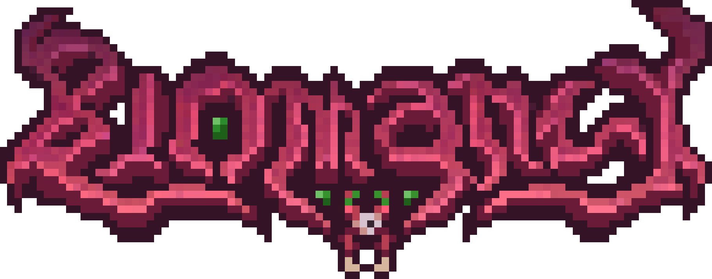

<h1 align="center">Biomancy</h1>

Biomancy is magi-tech Mod for Minecraft. The mod is inspired by Biopunk and Bio-Manipulation and features a fleshy art
style.

* [Download]
* [Discord]
* [Wiki]
* [Trello]

## Tech Stack

- [MinecraftForge](https://github.com/MinecraftForge/MinecraftForge) (modding API for Minecraft)
- [SpongePowered Mixin](https://github.com/SpongePowered/Mixin) (mixin and bytecode weaving framework)
- [GeckoLib](https://github.com/bernie-g/geckolib) (animation library)

### Integration with other Mods
- [JEI]

## Maven
Atm you can use https://www.cursemaven.com/

## Contributing
Pull Request are welcome.

For new features or major changes related to the **gameplay** or **art style** please [join our Discord][Discord] and request to join the dev team. 
This will give you access to the private mod development channels and resources such as the biomancy design document and concept board.

You can track the development progress via our [Trello Board][Trello].

## License
All code is licensed under the [MIT License](https://opensource.org/licenses/MIT).

All artwork (images, textures, models, animations, etc.) is licensed under the [Creative Commons Attribution-NonCommercial 4.0 International License](http://creativecommons.org/licenses/by-nc/4.0/), unless stated otherwise.

## Support
If you need help feel free to [join our Discord][Discord].

## User Guide
The mod provides no ingame guide book but uses tooltip descriptions & flavor texts instead. If you need further information you can read the github [Wiki].

Read the [Getting Started Guide](https://github.com/Elenterius/Biomancy/wiki/v2/Getting-Started) section if you don't know what to do at all.

### Recipes
To conveniently look up recipes ingame I recommend the use of the [JEI] mod.

[Download]: https://www.curseforge.com/minecraft/mc-mods/biomancy
[Discord]: https://discord.gg/424awTDdJJ
[Wiki]: https://github.com/Elenterius/Biomancy/wiki/v2
[Trello]: https://trello.com/b/GUKjOSAl
[JitPack]: https://jitpack.io/#Elenterius/Biomancy

[JEI]:https://www.curseforge.com/minecraft/mc-mods/jei
